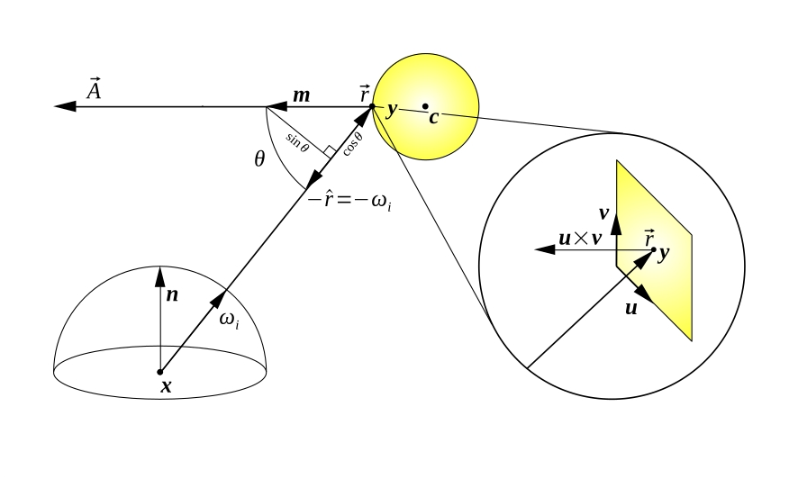
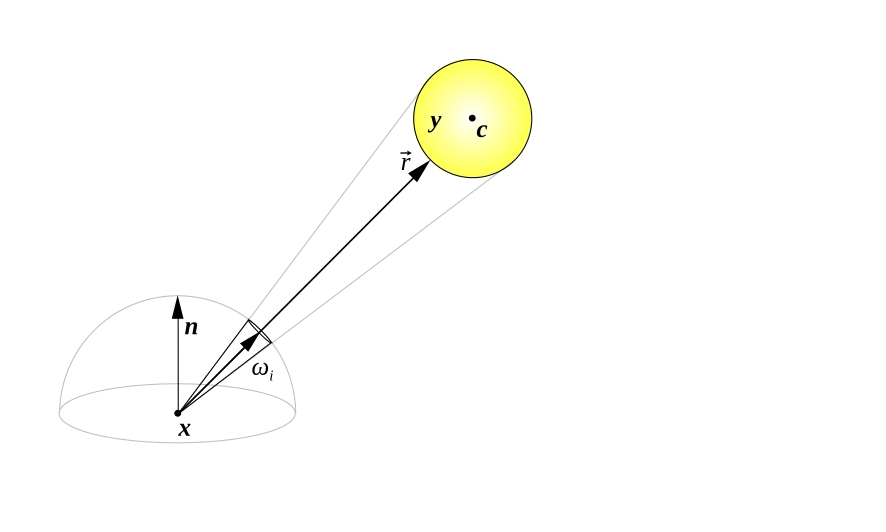
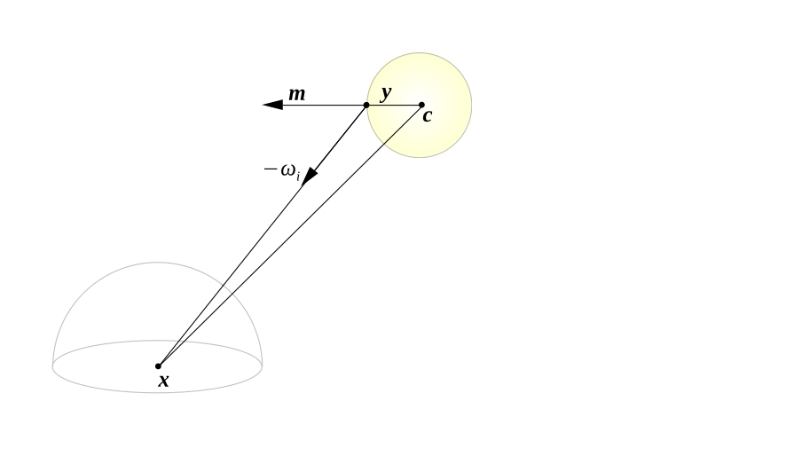
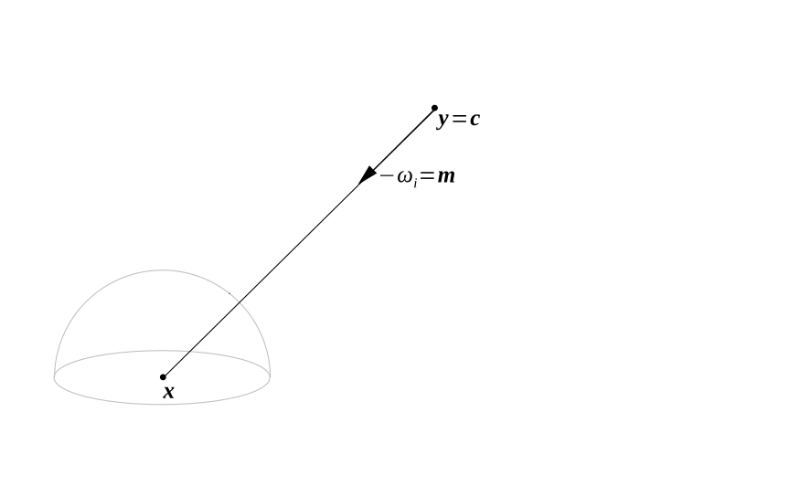
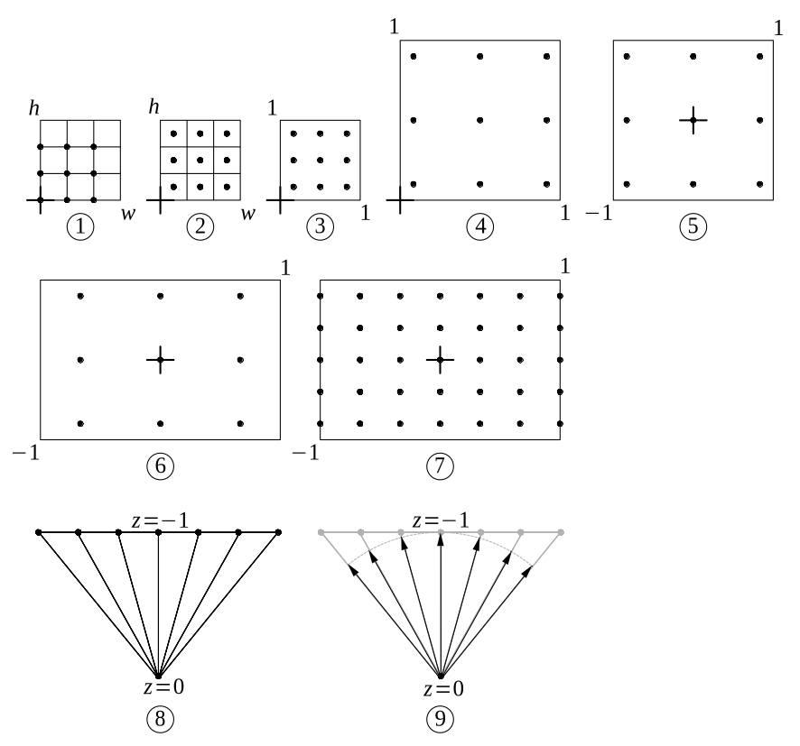
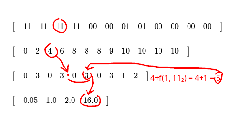
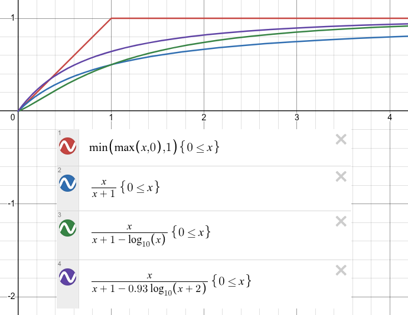
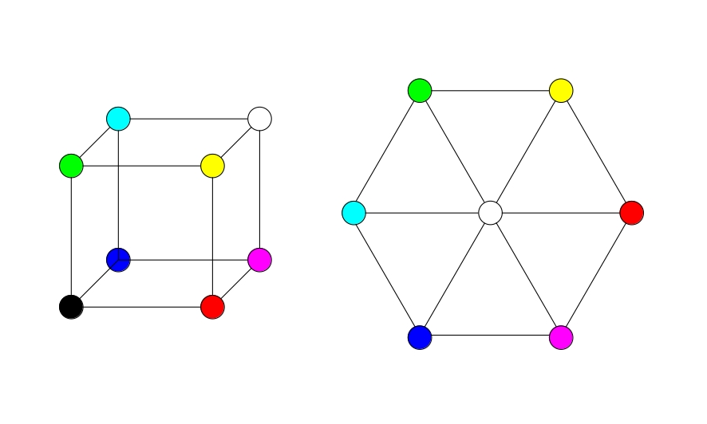
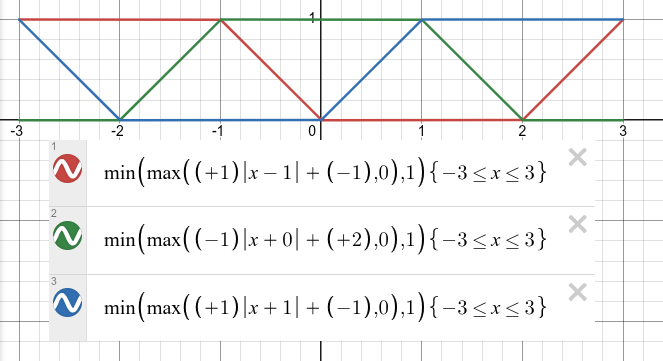
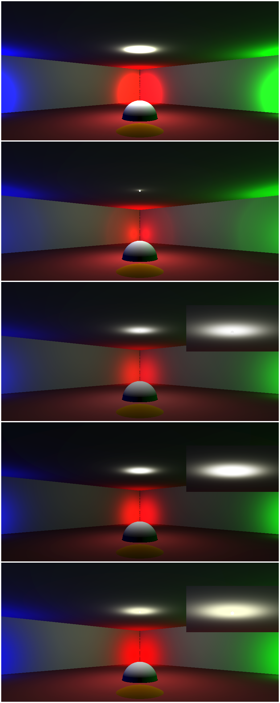

# Wavelength Collector Retrospective

Hello! How is everybody doing? I hope you've had a great Ludum! (it's been weeks, I know)

It seems that it is becoming tradition of mine, after the event, to write a long post explaining some topic that I think is hard of something that I implemented in my game with the hope of making it more approachable. Last time, [I explained my music writing process](https://ldjam.com/events/ludum-dare/57/lifted/lifted-retrospective-music). Since this time I made a ray tracer for my game, writing this retrospective has been a huge pain for weeks, but I hope the results make up for it.

In this post I will be explaining how I made a ray tracer for my Ludum Dare 58 Jam entry [Wavelength Collector](https://ldjam.com/events/ludum-dare/58/wavelength-collector) and what I've learned from my mistakes. If you want to follow this post alongside the code you can find it [here](https://github.com/andriybyelikov/ludumdare58).

My main source dealing with the inner workings of rendering and how to implement ray tracing is the book ***Real-Time Rendering, Fourth Edition***, in particular, chapters **5. Shading Basics**, **8. Light and Color**, **9. Physically Based Rendering**, **10. Local Illumination**, **11. Global Illumination**, **22. Intersection Test Methods**, and finally, **26. Real-Time Ray Tracing**, which is not included in the book, but is an online only chapter available for free at [realtimerendering.com](https://www.realtimerendering.com/). After writing this retrospective, however, I have come to the realization that literature is lacking when it comes to properly explaining things, and so I will be provide my own understanding.

In ray tracing, the idea is that a ray is shot from the camera through each pixel of the screen into the scene, then that ray hits a surface at a specific point, which emits or reflects a color based on many parameters, such as how much light energy the surface is receiving from light sources at that point or which wavelengths of the visible spectrum the surface's material absorbs, for example. This reflected color is then the final color of that pixel on the screen.

In reality, it doesn't make much sense to think about the camera shooting rays, instead we should be thinking of rays being shot from the scene through each pixel on the screen into the camera. The good news is that the rays in both of these cases are the same, we only need to negate their direction so that the rays coming out of the camera converge at the camera instead.

I think it's going to be easier if we take a leap of faith and dive straight into the rendering equation.

## The rendering equation

In order to render an image with ray tracing we have have to solve the [rendering equation](https://en.wikipedia.org/wiki/Rendering_equation) for each pixel.

The rendering equation computes spectral radiance coming out of point ***x*** in the direction ***ωₒ*** for wavelength ***λ*** at time ***t***.

```math
\begin{align*}

& L_o(\mathbf{x}, \omega_o, \lambda, t) = L_e(\mathbf{x}, \omega_o, \lambda, t) + L_r(\mathbf{x}, \omega_o, \lambda, t) \\
& L_r(\mathbf{x}, \omega_o, \lambda, t) = \int_\Omega f_r(\mathbf{x}, \omega_i, \omega_o, \lambda, t) L_i(\mathbf{x}, \omega_i, \lambda, t) (\omega_i \cdot \mathbf{n}) d \omega_i \\

\end{align*}
```

I think that in order for me to explain the rendering equation it's best to begin by stripping it from the terms we won't be needing.

For our purposes, we won't have any time-dependent parameters in the evaluation of the rendering equation. Instead we will inject the values of time-dependent parameters such positions and normals in camera-space already evaluated at time ***t***. This means we can safely omit ***t*** from the rendering equation.

```math
\begin{align*}

& L_o(\mathbf{x}, \omega_o, \lambda) = L_e(\mathbf{x}, \omega_o, \lambda) + L_r(\mathbf{x}, \omega_o, \lambda) \\
& L_r(\mathbf{x}, \omega_o, \lambda) = \int_\Omega f_r(\mathbf{x}, \omega_i, \omega_o, \lambda) L_i(\mathbf{x}, \omega_i, \lambda) (\omega_i \cdot \mathbf{n}) d \omega_i \\

\end{align*}
```

Let us now deal with the ***λ*** parameter. Solving the rendering equation for ***λ*** means solving it for a particular wavelength of the visible spectrum. In particular, we need to solve the rendering equation for all the wavelengths that our sensor is sensitive to. Our final sensor is the human eye, which relies on the combined input of three types of sensors to enable color vision: the L, M and S cone cells, each sensitive to a band of the visible spectrum centered around a wavelength roughly corresponding to the colors red, green and blue. Our final emitter, however, is a screen made up of arrays or red, green and blue light emitting components for each pixel. Each one of these components emits a narrow band that is contained within the band that the sensor can perceive for that color, thus narrowing further the range of of wavelengths for which we must evaluate the rendering equation. More than that, we have no way of telling the screen how much radiance should be emitted for each wavelength in these narrow bands, we can only control the intensity as a relative proportion of all three discrete components. The fact that each of these components emit narrow band of wavelengths is actually a physical limitation where the goal is to emit a single pure wavelength for each component. This means that our corresponding virtual sensor (the camera that is seeing the scene) is only sensitive to only three exact wavelengths: red, green and blue, and so we need to evaluate the rendering equation only for three wavelengths. For our purposes, altough we could store entire emission and reflectance spectral power distributions (SPDs) for lights and materials respectively as textures and evaluate the results of their interaction, it's considered too expensive to do so in real-time. Instead we will supply our emission and reflectance SPDs as sensor-referenced linear RGB values. Sensor-referenced means dividing the physical amount of energy emitted by the light source by the threshold amount of energy that saturates the sensor and clamping the result to ***1***. This results in a unitless quantity with domain ***[0-1]*** representing the desired intensity of each pixel component. As before, we will inject the values of the emission and reflectance SPDs as sensor-referenced linear RGB intensity values already evaluated for the three wavelengths ***λ***. This means we can safely omit ***λ*** from the rendering equation.

```math
\begin{align*}

& L_o(\mathbf{x}, \omega_o) = L_e(\mathbf{x}, \omega_o) + L_r(\mathbf{x}, \omega_o) \tag{1} \\
& L_r(\mathbf{x}, \omega_o) = \int_\Omega f_r(\mathbf{x}, \omega_i, \omega_o) L_i(\mathbf{x}, \omega_i) (\omega_i \cdot \mathbf{n}) d \omega_i \tag{2} \\

\end{align*}
```

Now we have a more manageable form of the rendering equation. Or rather, an equation split into two parts, two equations.

Equation (1) expresses that the amount of radiance coming out of point ***x*** in the direction ***ωₒ*** is equal to the sum of the radiance emitted at that point and the radiance reflected at that point.

Imagine a computer monitor, the screen emits light and thus has a non-zero ***Lₑ*** component. Now shine a flashlight near the edge of the monitor. The screen has not stopped emitting light, but the point on the screen where the flashlight shines now looks brighter, because the material of the screen is also reflecting the flashlight's light. At that point, both ***Lₑ*** and ***Lᵣ*** components are non-zero. On the other hand, the plastic edge of the monitor only has a non-zero ***Lᵣ*** component because it does not emit light on its own.

Equation (2) expresses that the amount of radiance reflected at point ***x*** in the direction ***ωₒ*** is the sum of

- the incoming radiance ***Lᵢ***, which has the same form as ***Lₒ***,
- times the directional attenuation ***(ωᵢ · n)***, because incoming light rays spread farther apart at the surface as it is tilted,
- times the bidirectional reflectance distribution function (BRDF) ***fᵣ***, which controls how much radiance incoming from direction ***ωᵢ*** comes out in direction ***ωₒ*** based on material properties (for example, a BRDF modeling absorption won't let any radiance for the green or blue wavelenghts pass through in the outgoing direction ***ωₒ*** in the case of a red surface),

evaluated for all possible incoming directions ***ωᵢ*** in the infinite set of directions ***Ω***. Geometrically, ***Ω*** is the surface or shell of the hemisphere centered at point **x** with normal ***n***, which describes all possible incoming directions hitting a surface at point ***x***.

## Evaluating the rendering equation in real-time

Notice that the reflected radiance term ***Lᵣ*** is not computable as-is because (a) the infinite set of directions ***Ω*** is uncountable and (b) the recursivity introduced by ***Lᵢ*** is non-terminating. (a) means that it's impossible to write an algorithm to list all the possible directions ***ωᵢ***, and (b) means, for our purposes, that we can't compile our shader, because the GPU driver will refuse to compile a shader if it detects recursivity.

What we need to do in order to make ***Lᵣ*** computable is make the set of incoming directions ***ωᵢ*** finite and get rid of explicit recursivity. Additionally, in order to be able to evaluate the rendering equation in real-time at interactive rates we need to minimize the amount of incoming directions to sample and the depth of ***Lᵢ*** evaluations.

The following are my geometry diagrams and math notes rigorously explaining the derivation of a viable model for the rendering equation. And these are interesting results because it seems that literature does not bother with explaining these things. Deriving these has been really helpful to advance my understanding.

### Derivation of the rendering equation for point lights

Let's begin by deriving the reflected radiance term for point lights. Our path to point lights will consist in shrinking a spherical area light till its measured area becomes zero. See Figure 1.



> **Figure 1.** On the left, a surface centered at ***x*** with normal ***n*** is illuminated from direction ***ωᵢ*** by point ***y*** of a spherical area light centered at ***c***. ***r*** is the view vector form ***x*** to ***y***. ***m*** is the surface normal of the area light at point ***y***. ***A*** is the vector that has direction ***m*** and length equal to the area of the infinitessimal patch centered at point ***y***. On the right, a close up view of this patch shows the relationship between the view vector ***r*** and point ***y***, which can be both a 3D point in space or a 2D point on the scalar field defined by tangent vectors ***u*** and ***v***. Notice that the normal vector ***u*** × ***v*** is related to vectors ***m*** and ***A***. Also notice ***cos θ***, the projection of ***m*** onto -***ωᵢ***, or how small ***m*** appears from -***ωᵢ*** due to ***m*** being tilted away.

Notice that the spherical area light is not visible from the whole infinite set of directions defined by the shell of the hemisphere (this would only happen if ***x*** was exactly on the surface of the area light or inside its closed surface), but only from an infinite subset of it. In the case of a spherical area light the [solid angle](https://en.wikipedia.org/wiki/Solid_angles) of directions from which it is visible is exactly the intersection between the surface of the hemisphere and the volume of the cone with apex at ***x*** fitted onto the spherical area light. See Figure 2.



> **Figure 2.** The hemisphere defining the infinite set of directions to sample, when restricted only to the directions from which the spherical area light is visible, has shrunk the size of the solid angle of directions to sample from 2π steradians (half a sphere) to a possibly much smaller solid angle. Keep in mind that the smaller set of directions to sample remains infinite, however.

To go from the model in Figure 1 to the model on Figure 2 we need to perform a change of variables in the reflected radiance term using the [Jacobian determinant](https://en.wikipedia.org/wiki/Jacobian_matrix_and_determinant).

```math
\begin{align*}

& \text{Recall the reflected radiance term.}
\\

& L_r(\mathbf{x}, \omega_o) =
\int_\Omega
f_r(\mathbf{x}, \omega_i, \omega_o)
L_i(\mathbf{x}, \omega_i)
(\omega_i \cdot \mathbf{n})
d \omega_i
\\

& \text{Express the solid angle differential in terms of the area differential and in terms of the parametrized area differential.}
\\

& d\omega_i
= |J| dA
= |J| du dv
\\

& \text{Arrange the Jacobian determinant.}
\\

& |J|
=
\left|
  \begin{pmatrix}
    -\omega_i & \frac{\delta \hat{r}}{\delta u} & \frac{\delta \hat{r}}{\delta v} \\
  \end{pmatrix}^T
\right|
=
\begin{vmatrix}
  -\omega_{i_x} & -\omega_{i_y} & -\omega_{i_z} \\
  \frac{\delta \hat{r}_x}{\delta u} & \frac{\delta \hat{r}_y}{\delta u} & \frac{\delta \hat{r}_z}{\delta u} \\
  \frac{\delta \hat{r}_x}{\delta v} & \frac{\delta \hat{r}_y}{\delta v} & \frac{\delta \hat{r}_z}{\delta v} \\
\end{vmatrix}
\\

& \text{Rewrite the Jacobian determinant in terms of geometric operations and evaluate.}
\\

& |J|
= -\omega_i \cdot \left( \frac{\delta \hat{r}}{\delta u} \times \frac{\delta \hat{r}}{\delta v} \right)
= -\omega_i \cdot \left( \frac{\delta}{\delta u} \frac{\vec{r}}{\|\vec{r}\|} \times \frac{\delta}{\delta v} \frac{\vec{r}}{\|\vec{r}\|} \right)
= -\omega_i \cdot \left( \frac{1}{\|\vec{r}\|} \frac{\delta \vec{r}}{\delta u} \times \frac{1}{\|\vec{r}\|} \frac{\delta \vec{r}}{\delta v} \right)
= -\omega_i \cdot \frac{1}{\|\vec{r}\|^2} \left( \frac{\delta \vec{r} }{\delta u}\times \frac{\delta \vec{r}}{\delta v} \right)
= \frac{-\omega_i \cdot \left( \frac{\delta \vec{r} }{\delta u}\times \frac{\delta \vec{r}}{\delta v} \right)}{\|\vec{r}\|^2}
\\

& \text{Substitute the Jacobian determinant in terms of the parametrized area differential back in.}
\\

& d\omega_i
= |J| du dv
= \frac{-\omega_i \cdot \left( \frac{\delta \vec{r} }{\delta u}\times \frac{\delta \vec{r}}{\delta v} \right)}{\|\vec{r}\|^2} du dv
\\

& \text{Rewrite the solid angle differential in terms of the unparametrized area differential,}
\\

& \text{absorbing the cross product} \left( \frac{\delta \vec{r} }{\delta u}\times \frac{\delta \vec{r}}{\delta v} \right) \text{ into a surface patch normal term } \mathbf{m} \text{.}
\\

& d\omega_i
= |J| dA
= \frac{-\omega_i \cdot \mathbf{m}}{\|\vec{r}\|^2} dA
\\

& \text{Develop the reflected radiance term.}
\\

& L_r(\mathbf{x}, \omega_o) =
\int_\Omega
f_r(\mathbf{x}, \omega_i, \omega_o)
L_i(\mathbf{x}, \omega_i)
(\omega_i \cdot \mathbf{n})
d \omega_i
=
\int_A
f_r(\mathbf{x}, \omega_i, \omega_o)
L_i(\mathbf{x}, \omega_i)
\frac{(\omega_i \cdot \mathbf{n}) (-\omega_i \cdot \mathbf{m})}{\|\vec{r}\|^2}
dA
\\

\end{align*}
```

Before continuing with the development of the reflected radiance term, let's take a look at what happens to the (-***ωᵢ*** · ***m***) term when we shrink the sphere to a point. See Figure 3.



> **Figure 3.** The center ***c*** of the spherical area light,  the point ***y*** on the spherical area light surface, and the point ***x*** on the illuminated surface form the triangle ***cyx***.

```math
\begin{align*}

& \text{Notice that }

\mathbf{c} - \mathbf{x} = (\mathbf{y} - \mathbf{c}) + (\mathbf{x} - \mathbf{y})

\text{.}

\\

& \text{Therefore, the matrix }

\begin{pmatrix}
  \mathbf{y} - \mathbf{c} & \mathbf{x} - \mathbf{y} & \mathbf{c} - \mathbf{x} \\
\end{pmatrix}

\text{ has rank 2.}

\\

& \text{Geometrically, this means that the system formed by the three vectors is a plane.}

\\

& \text{Notice that } -\mathbf{\omega_i} \text{ is parallel to } \mathbf{x} - \mathbf{y} \text{, and that } \mathbf{m} \text{ is parallel to } \mathbf{y} - \mathbf{c} \text{.}
\\

& \text{The radius of the spherical area light is } \| \mathbf{y} - \mathbf{c} \| \text{.}
\\

& \text{If we shrink the spherical area light to a point, then } \| \mathbf{y} - \mathbf{c} \| = 0 \implies \mathbf{y} = \mathbf{c} \text{.}
\\

&

\begin{pmatrix}
  \mathbf{y} - \mathbf{c} & \mathbf{x} - \mathbf{y} & \mathbf{c} - \mathbf{x} \\
\end{pmatrix}
=
\begin{pmatrix}
  \mathbf{c} - \mathbf{c} & \mathbf{x} - \mathbf{c} & \mathbf{c} - \mathbf{x} \\
\end{pmatrix}
=
\begin{pmatrix}
  \mathbf{0} & (\mathbf{x} - \mathbf{c}) & -(\mathbf{x} - \mathbf{c}) \\
\end{pmatrix}

\\

& \text{Therefore, the matrix }

\begin{pmatrix}
  \mathbf{y} - \mathbf{c} & \mathbf{x} - \mathbf{y} & \mathbf{c} - \mathbf{x} \\
\end{pmatrix}

\text{ now has rank 1.}

\\

& \text{Geometrically, this means that the system formed by the three vectors is a line. See Figure 4.}

\\

& \text{This means that vectors } \mathbf{y} - \mathbf{c} \text{, } \mathbf{x} - \mathbf{y} \text{ and } \mathbf{c} - \mathbf{x} \text{ lie on the same line and therefore are parallel.}

\\

& \text{And since } -\mathbf{\omega_i} \text{ is parallel to } \mathbf{x} - \mathbf{y} \text{ and } \mathbf{m} \text{ is parallel to } \mathbf{y} - \mathbf{c} \text{, this means that } -\mathbf{\omega_i} \text{ and } \mathbf{m} \text{ are also parallel.}

\\

& \mathbf{y} - \mathbf{c} \parallel \mathbf{x} - \mathbf{y}, -\mathbf{\omega_i} \parallel \mathbf{x} - \mathbf{y}, \mathbf{m} \parallel \mathbf{y} - \mathbf{c} \implies -\mathbf{\omega_i} \parallel \mathbf{m} \implies -\mathbf{\omega_i} \cdot \mathbf{m} = \cos(0) = 1

\end{align*}
```



> **Figure 4.** If ***y*** = ***c***, then the triangle ***cyx*** collapses into a line ***yx***, forcing -***ωᵢ*** and ***m*** lie on the same line. Since both are unit vectors, they become the same vector.

```math
\begin{align*}

& \text{Recall the reflected radiance term development.}
\\

& L_r(\mathbf{x}, \omega_o) =
\int_\Omega
f_r(\mathbf{x}, \omega_i, \omega_o)
L_i(\mathbf{x}, \omega_i)
(\omega_i \cdot \mathbf{n})
d \omega_i
\\

& L_r(\mathbf{x}, \omega_o) =
\int_A
f_r(\mathbf{x}, \omega_i, \omega_o)
L_i(\mathbf{x}, \omega_i)
\frac{(\omega_i \cdot \mathbf{n}) (-\omega_i \cdot \mathbf{m})}{\|\vec{r}\|^2}
dA
\\

& \text{The previous proof using matrix ranks allows us to evaluate the } (-\omega_i \cdot \mathbf{m}) \text{ term very easily. }
\\

& \text{Otherwise, we would have needed to evaluate } -\omega_i \cdot \mathbf{m} = \frac{\mathbf{x} - \mathbf{y}}{\| \mathbf{x} - \mathbf{y} \|} \cdot \frac{\mathbf{y} - \mathbf{c}}{\| \mathbf{y} - \mathbf{c} \|}, \text{triggering a } \frac{0}{0} \text{ indetermination.}
\\

& \text{Substitute } -\omega_i \cdot \mathbf{m} = 1 \text{.}
\\

& L_r(\mathbf{x}, \omega_o) =
\int_A
f_r(\mathbf{x}, \omega_i, \omega_o)
L_i(\mathbf{x}, \omega_i)
\frac{(\omega_i \cdot \mathbf{n})}{\|\vec{r}\|^2}
dA
\\

& \text{Define terms exactly.}
\\

& L_r(\mathbf{x}, \omega_o) =
\int_{\mathbf{y} \in R}
f_r(\mathbf{x}, \widehat{\mathbf{xy}}, \omega_o)
L_i(\mathbf{x}, \widehat{\mathbf{xy}})
\frac
  {(\widehat{\mathbf{xy}} \cdot \mathbf{n})}
  {\|\overrightarrow{\mathbf{xy}}\|^2}
dA
\\

& \text{Since the spherical area light has shrunk to a point light, there exists only a single } \mathbf{y} = \mathbf{y_0} \text{ to sample.}
\\

& \text{Apply the } \textit{Dirac delta function } \delta(\mathbf{y} - \mathbf{y_0}) \text{ to make the sample at point } \mathbf{y_0} \text{ account for the entire area}.
\\

& L_r(\mathbf{x}, \omega_o) =
\int_{\mathbf{y} \in R}
f_r(\mathbf{x}, \widehat{\mathbf{xy}}, \omega_o)
L_i(\mathbf{x}, \widehat{\mathbf{xy}})
\frac
  {(\widehat{\mathbf{xy}} \cdot \mathbf{n})}
  {\|\overrightarrow{\mathbf{xy}}\|^2}
\delta(\mathbf{y} - \mathbf{y_0})
dA
\\

& \text{Apply the } \textit{sifting property} \text{ of the } \textit{Dirac delta function} \text{ to resolve the integral.}
\\

& L_r(\mathbf{x}, \omega_o) =
f_r(\mathbf{x}, \widehat{\mathbf{xy_0}}, \omega_o)
L_i(\mathbf{x}, \widehat{\mathbf{xy_0}})
\frac
  {(\widehat{\mathbf{xy_0}} \cdot \mathbf{n})}
  {\|\overrightarrow{\mathbf{xy_0}}\|^2}
\\

& \text{Rename } \mathbf{y_0} \text{ to } \mathbf{y} \text{ for brevity.}
\\

& \text{This is the final form of the reflected radiance term for point lights, where } \mathbf{y} \text{ is the position of the point light.}
\\

& L_r(\mathbf{x}, \omega_o) =
f_r(\mathbf{x}, \widehat{\mathbf{xy}}, \omega_o)
L_i(\mathbf{x}, \widehat{\mathbf{xy}})
\frac
  {(\widehat{\mathbf{xy}} \cdot \mathbf{n})}
  {\|\overrightarrow{\mathbf{xy}}\|^2}
\\

\end{align*}
```

> For reference: [Dirac delta function](https://en.wikipedia.org/wiki/Dirac_delta_function)

### Simplifying the rendering equation

Now let's tie it all together.

```math
\begin{align*}

& \text{Let } O \text{ be the set of objects in the scene.}
\\

& \text{Let } E \text{ be the subset of objects in } O
\text{ for which the emission SPD } \rho_e \text{ at distance } r_0 \text{ } \text{ is defined.}
\\

& \text{Let } R \text{ be the subset of objects in } O
\text{ for which the reflectance SPD } \rho_r \text{ is defined.}
\\

& \text{Let } \mathbf{r} (\mathbf{o}, \mathbf{d}) \text{ be the ray tracing function that given an origin } \mathbf{o} \text{ and a direction } \mathbf{d}
\\

& \text{returns the value of } t \text{ which can be plugged into the ray equation } \mathbf{x} = \mathbf{r}(t) = \mathbf{o} + t \mathbf{d}
\\

& \text{to obtain the point } \mathbf{x} \text{ where the ray intersected with the closest object.}
\\

& L_o(\mathbf{x}, \omega_o) = L_e(\mathbf{x}, \omega_o) + L_r(\mathbf{x}, \omega_o)
\\

& L_e(\mathbf{x}, \omega_o) = \begin{cases}
  \rho_e (r_0/r_0)^2 & \text{when ``object hit by ray at } \mathbf{x} \text{''} \in E
  \\
  0 & \text{otherwise}
  \\
\end{cases}
\\

& L_r(\mathbf{x}, \omega_o) = \begin{cases}
  L_r'(\mathbf{x}, \omega_o) & \text{when ``object hit by ray at } \mathbf{x} \text{''} \in R
  \\
  0 & \text{otherwise}
  \\
\end{cases}
\\

& f_r(\mathbf{x}, \omega_i, \omega_o) = \rho_r \text{ (See Note 1.)}
\\

& L_i(\mathbf{x}, \omega_i) = L_e(\mathbf{r}(\mathbf{x}, \omega_i), -\omega_i)
\\

&\\

& \text{Recall the reflected radiance term for point lights.}
\\

& L_r(\mathbf{x}, \omega_o) =
f_r(\mathbf{x}, \widehat{\mathbf{xy}}, \omega_o)
L_i(\mathbf{x}, \widehat{\mathbf{xy}})
\frac
  {(\widehat{\mathbf{xy}} \cdot \mathbf{n})}
  {\|\overrightarrow{\mathbf{xy}}\|^2}
\\

& \text{For multiple point lights, the total reflected radiance is the sum of the reflected radiance terms}
\\

& \text{for each light. Also, we must ensure that the point light is visible from the illuminated point } \mathbf{x} \text{.}
\\

& \text{Prefiltering the set of point lights to consider for each illuminated point } \mathbf{x} \text{ is one way to do this,}
\\

& \text{but it's expensive in terms of time, memory, time to access that memory, and it also introduces}
\\

& \text{branch divergence. Simply nullifying contribution when } (\omega_i \cdot \mathbf{n}) < 0 \text{ is the fastest and cheapest}
\\

& \text{way to make sure that point lights that are not visible from the illuminated point } \mathbf{x} \text{ are not}
\\
& \text{being considered.}
\\

& L_r'(\mathbf{x}, \omega_o) =
\sum_{i \in E}
f_r(\mathbf{x}, \widehat{\mathbf{xy_i}}, \omega_o)
L_i(\mathbf{x}, \widehat{\mathbf{xy_i}})
\frac
  {\max(\widehat{\mathbf{xy_i}} \cdot \mathbf{n}, 0)}
  {\|\overrightarrow{\mathbf{xy_i}}\|^2}
\\

& \text{Rewrite vectors as point differences.}
\\

& L_r'(\mathbf{x}, \omega_o) =
\sum_{i \in E}
f_r \left(\mathbf{x}, \frac{\mathbf{y_i} - \mathbf{x}}{\| \mathbf{y_i} - \mathbf{x} \|}, \omega_o \right)
L_i \left(\mathbf{x}, \frac{\mathbf{y_i} - \mathbf{x}}{\| \mathbf{y_i} - \mathbf{x} \|} \right)
\max \left( \frac{\mathbf{y_i} - \mathbf{x}}{\| \mathbf{y_i} - \mathbf{x} \|} \cdot \mathbf{n}, 0 \right)
\frac{1}{\| \mathbf{y_i} - \mathbf{x} \|^2}
\\

& \text{Substitute } f_r \text{. Since it doesn't depend on } i \in E \text{, we can factor it out of the sum.}
\\

& L_r'(\mathbf{x}, \omega_o) =
\rho_r
\sum_{i \in E}
L_i \left(\mathbf{x}, \frac{\mathbf{y_i} - \mathbf{x}}{\| \mathbf{y_i} - \mathbf{x} \|} \right)
\max \left( \frac{\mathbf{y_i} - \mathbf{x}}{\| \mathbf{y_i} - \mathbf{x} \|} \cdot \mathbf{n}, 0 \right)
\frac{1}{\| \mathbf{y_i} - \mathbf{x} \|^2}
\\

& \text{Substitute } L_i \text{.}
\\

& L_r'(\mathbf{x}, \omega_o) =
\rho_r
\sum_{i \in E}
L_e \left( \mathbf{r} \left( \mathbf{x}, \frac{\mathbf{y_i} - \mathbf{x}}{\| \mathbf{y_i} - \mathbf{x} \|} \right), -\frac{\mathbf{y_i} - \mathbf{x}}{\| \mathbf{y_i} - \mathbf{x} \|} \right)
\max \left( \frac{\mathbf{y_i} - \mathbf{x}}{\| \mathbf{y_i} - \mathbf{x} \|} \cdot \mathbf{n}, 0 \right)
\frac{1}{\| \mathbf{y_i} - \mathbf{x} \|^2}
\\

& \text{We can leave } L_e \text{ as-is, but let us take a brief look at its two possible substitutions.}
\\

&\\

& \text{When ``object hit by ray at } \mathbf{x} \text{''} \notin E \text{:}
\\

&
L_e \left( \mathbf{r} \left( \mathbf{x}, \frac{\mathbf{y_i} - \mathbf{x}}{\| \mathbf{y_i} - \mathbf{x} \|} \right), -\frac{\mathbf{y_i} - \mathbf{x}}{\| \mathbf{y_i} - \mathbf{x} \|} \right)
\max \left( \frac{\mathbf{y_i} - \mathbf{x}}{\| \mathbf{y_i} - \mathbf{x} \|} \cdot \mathbf{n}, 0 \right)
\frac{1}{\| \mathbf{y_i} - \mathbf{x} \|^2}
\\

&
= 0
\max \left( \frac{\mathbf{y_i} - \mathbf{x}}{\| \mathbf{y_i} - \mathbf{x} \|} \cdot \mathbf{n}, 0 \right)
\frac{1}{\| \mathbf{y_i} - \mathbf{x} \|^2}
\\

& = 0
\\

& \text{This means that the ray to point light } i \text{ was occluded and so } \textbf{x} \text{ won't be illuminated by light } i \text{.}
\\

&\\

& \text{When ``object hit by ray at } \mathbf{x} \text{''} \in E \text{:}
\\

&
L_e \left( \mathbf{r} \left( \mathbf{x}, \frac{\mathbf{y_i} - \mathbf{x}}{\| \mathbf{y_i} - \mathbf{x} \|} \right), -\frac{\mathbf{y_i} - \mathbf{x}}{\| \mathbf{y_i} - \mathbf{x} \|} \right)
\max \left( \frac{\mathbf{y_i} - \mathbf{x}}{\| \mathbf{y_i} - \mathbf{x} \|} \cdot \mathbf{n}, 0 \right)
\frac{1}{\| \mathbf{y_i} - \mathbf{x} \|^2}
\\

& =
\rho_e \left(\frac{r_0}{r_0}\right)^2
\max \left( \frac{\mathbf{y_i} - \mathbf{x}}{\| \mathbf{y_i} - \mathbf{x} \|} \cdot \mathbf{n}, 0 \right)
\frac{1}{\| \mathbf{y_i} - \mathbf{x} \|^2}
\\

& =
\left(\frac{\rho_e }{r_0^2}\right)
\max \left( \frac{\mathbf{y_i} - \mathbf{x}}{\| \mathbf{y_i} - \mathbf{x} \|} \cdot \mathbf{n}, 0 \right)
\frac{r_0^2}{\| \mathbf{y_i} - \mathbf{x} \|^2}
\\

& \text{You can see I have rearranged the emission SPD's reference distance terms a bit.}
\\

& \text{We will see the reason for this arrangement a bit later.}
\\

& \text{But for now we can finally appreciate the full path of a ray of light that illuminates a surface.}
\\

& L_r'(\mathbf{x}, \omega_o) =
\underbrace{\rho_r}_{\text{Absorption}}
\underbrace{
\underbrace{\left(\frac{\rho_e }{r_0^2}\right)}_{\text{Source min-max normalized radiance}}
\underbrace{\max \left( \frac{\mathbf{y_i} - \mathbf{x}}{\| \mathbf{y_i} - \mathbf{x} \|} \cdot \mathbf{n}, 0 \right)}_{\text{Directional attenuation}}
\underbrace{\frac{r_0^2}{\| \mathbf{y_i} - \mathbf{x} \|^2}}_{\text{Inverse squared distance attenuation}}
}_{\text{Incoming radiance}}
\\

&\\

& \text{Notes:}
\\

& \textbf{Note 1. } \text{This is the Lambertian BRDF.}
\\

& \text{In literature, the Lambertian BRDF is modeled as either } \rho / \pi \text{ or } \rho \text{, without much explanation.}
\\

& \text{The } 1 / \pi \text{ term appears precisely to compensate for the integration over a hemisphere.}
\\

& \int_\Omega (\omega_i \cdot \mathbf{n}) d\omega_i = \int_{\phi = 0}^{2 \pi} \int_{\theta = 0}^\frac{\pi}{2} \cos \theta \sin \theta d\theta d\phi = \pi
\\

& \text{The final color resulting from the contribution from all directions } \omega_i \in \Omega \text{ from a white light}
\\

& \text{facing the surface head-on must be exactly } \rho \text{ to ensure energy conservation.}
\\

& \text{For point lights, we are not sampling the whole hemisphere of directions because}
\\

& \text{there exists only a single direction from which the light is visible, so no division there.}
\\

& \text{For an area light, the exact subtended solid angle is not trivial to calculate,}
\\

& \text{but the Lambertian term would look like } \rho / \omega \text{ where the cosine-weighted solid angle } \omega \in (0, \pi] \text{.}
\\

\end{align*}
```

Let's take a step back and look at our final math.

```math
\begin{align*}

& L_o(\mathbf{x}, \omega_o) = L_e(\mathbf{x}, \omega_o) + L_r(\mathbf{x}, \omega_o)
\\

& L_e(\mathbf{x}, \omega_o) = \begin{cases} \displaystyle
  \left( \frac{\rho_e}{r_0^2} \right) r_0^2 & \text{when ``object hit by ray at } \mathbf{x} \text{''} \in E
  \\
  0 & \text{otherwise}
  \\
\end{cases}
\\

& L_r(\mathbf{x}, \omega_o) = \begin{cases} \displaystyle
  \rho_r
  \sum_{i \in E}
  L_e \left( \mathbf{r} \left( \mathbf{x}, \frac{\mathbf{y_i} - \mathbf{x}}{\| \mathbf{y_i} - \mathbf{x} \|} \right), -\frac{\mathbf{y_i} - \mathbf{x}}{\| \mathbf{y_i} - \mathbf{x} \|} \right)
  \max \left( \frac{\mathbf{y_i} - \mathbf{x}}{\| \mathbf{y_i} - \mathbf{x} \|} \cdot \mathbf{n}, 0 \right)
  \frac{1}{\| \mathbf{y_i} - \mathbf{x} \|^2}
& \text{when ``object hit by ray at } \mathbf{x} \text{''} \in R
  \\
  0 & \text{otherwise}
  \\
\end{cases}
\\

\end{align*}
```

### Implementing the rendering equation

With these equations we've made the rendering equation computable. We went from having an infinite set of directions to sample and non-terminating recursivity, to having a discrete, finite amount of directions to sample, as many as the number of point lights in our scene, in fact, and we've terminated recursivity after just one bounce to the point light to query whether it is visible from our surface point or if the path to it is occluded by another object.

Now we want to talk about three things:

- how to optimize the rendering equation code for evaluation at interactive rates,
- how to generate the primary rays from the camera through the screen pixels to be consumed by ***Lₒ***,
- how to plug in information about our scene into the rendering equation.

#### Optimizing the rendering equation

We want to avoid divisions and square roots, which are expensive operations. We can avoid both using the built-in GLSL fast inverse square root function `inversesqrt`, which is a cheaper and faster operation that gives an approximate result with negligible error, by doing the following intermediate calculations.

```math
\begin{align*}

& L_o(\mathbf{x}, \omega_o) = L_e(\mathbf{x}, \omega_o) + L_r(\mathbf{x}, \omega_o)
\\

& L_e(\mathbf{x}, \omega_o) = \begin{cases} \displaystyle
  \left( \frac{\rho_e}{r_0^2} \right) r_0^2 & \text{when ``object hit by ray at } \mathbf{x} \text{''} \in E
  \\
  0 & \text{otherwise}
  \\
\end{cases}
\\

& L_r(\mathbf{x}, \omega_o) = \begin{cases} \displaystyle
  \begin{cases} 
    \text{Intermediate calculations:}
    \\
    \vec{r} = \mathbf{y_i} - \mathbf{x}
    \\
    r^2 = \vec{r} \cdot \vec{r}
    \\
    r^{-1} = \mathtt{inversesqrt}(r^2) \overset{\mathrm{negl}}{\approx} \dfrac{1}{\| \mathbf{y_i} - \mathbf{x} \|}
    \\
    r^{-2} = (r^{-1})(r^{-1}) \overset{\mathrm{negl}}{\approx} \dfrac{1}{\| \mathbf{y_i} - \mathbf{x} \|^2}
    \\
    \hat{r} = (r^{-1})\vec{r} \overset{\mathrm{negl}}{\approx} \dfrac{\mathbf{y_i} - \mathbf{x}}{\| \mathbf{y_i} - \mathbf{x} \|}
    \\
  \end{cases}
  \\
  \rho_r
  \displaystyle \sum_{i \in E}
  L_e \left( \mathbf{r} \left( \mathbf{x}, \hat{r} \right), -\hat{r} \right)
  \max \left( \hat{r} \cdot \mathbf{n}, 0 \right)
  (r^{-2})
& \text{when ``object hit by ray at } \mathbf{x} \text{''} \in R
  \\
  0 & \text{otherwise}
  \\
\end{cases}
\\

\end{align*}
```

#### Adjusting for edge cases

There are two edge cases to consider:

- When ***yᵢ*** - ***x*** = 0, it results in a division by zero. Usually, it is advised to add a very small number ***ε*** so that when ***yᵢ*** - ***x*** = 0, then ***yᵢ*** - ***x*** + ***ε*** = ***ε***. I didn't need to do that because in my scene all the point lights are placed inside small emissive spheres, so the edge case where  ***yᵢ*** = ***x*** can never happen. The ray will always hit the sphere surface before it hits its center.

- When querying for point light occlusion, ***x*** may lie under the surface due to floating point precision effects, resulting in self-shadowing. It is advised to displace ***x*** by ***ε n***, that is, a small amount ***ε*** in the normal direction ***n***. I chose ***ε = 0.0001***, for example. This ray origin ***x'*** is the same for all point lights, so it can be computed once out of the sum.

```math
\begin{align*}

& L_o(\mathbf{x}, \omega_o) = L_e(\mathbf{x}, \omega_o) + L_r(\mathbf{x}, \omega_o)
\\

& L_e(\mathbf{x}, \omega_o) = \begin{cases} \displaystyle
  \left( \frac{\rho_e}{r_0^2} \right) r_0^2 & \text{when ``object hit by ray at } \mathbf{x} \text{''} \in E
  \\
  0 & \text{otherwise}
  \\
\end{cases}
\\

& L_r(\mathbf{x}, \omega_o) = \begin{cases} \displaystyle
  \begin{cases} 
    \text{Intermediate calculations:}
    \\
    \vec{r} = \mathbf{y_i} - \mathbf{x}
    \\
    r^2 = \vec{r} \cdot \vec{r}
    \\
    r^{-1} = \mathtt{inversesqrt}(r^2) \overset{\mathrm{negl}}{\approx} \dfrac{1}{\| \mathbf{y_i} - \mathbf{x} \|}
    \\
    r^{-2} = (r^{-1})(r^{-1}) \overset{\mathrm{negl}}{\approx} \dfrac{1}{\| \mathbf{y_i} - \mathbf{x} \|^2}
    \\
    \hat{r} = (r^{-1})\vec{r} \overset{\mathrm{negl}}{\approx} \dfrac{\mathbf{y_i} - \mathbf{x}}{\| \mathbf{y_i} - \mathbf{x} \|}
    \\
    \mathbf{x'} = \mathbf{x} + \epsilon \mathbf{n}
    \\
  \end{cases}
  \\
  \rho_r
  \displaystyle \sum_{i \in E}
  L_e \left( \mathbf{r} \left( \mathbf{x'}, \hat{r} \right), -\hat{r} \right)
  \max \left( \hat{r} \cdot \mathbf{n}, 0 \right)
  (r^{-2})
& \text{when ``object hit by ray at } \mathbf{x} \text{''} \in R
  \\
  0 & \text{otherwise}
  \\
\end{cases}
\\

\end{align*}
```

#### Primary ray generation

Remember that we need to evaluate the rendering equation once for each pixel on the screen. This means evaluating ***Lₒ*** for the ray passing through the pixel. Figure 5 illustrates the process of generating a ray from a pixel on the screen.



> **Figure 5.** Sequence of operations that given a pixel coordinate generates the ray that passes through its centroid. (1) The pixel position is its coordinate, i.e., the position of its lower-left corner. (2) We add half a pixel's size to obtain the position of the pixel's centroid. (3) Divide by the resolution to map the pixel position to ***[0, 1]***, (4) multiply by ***2*** for ***[0, 2]*** and (5) subtract 1 for ***[-1, 1]***. The sequence (1-5) is also known as the Normalized Device Coordinates (NDC) transform. (6) Multiply by the aspect ratio to reintroduce the shape of the gap between rays. (7) Multiply by ***tan(φ/2)*** to scale the gap between rays to expand/contract the field of view, where ***φ*** is the vertical field of view (VFOV) in radians. (8) Set the plane where the pixel position lies at ***z = -1*** and trace a vector from the camera position at the origin to the pixel position. (9) The normalized vector is the ray direction for that pixel.

We can precompute a matrix ***Q*** on the CPU that performs operations (1-7) and pass it as a uniform to the GPU. Operation (8) is cheaper to perform manually on the GPU, as promoting dimensions implies going from a 3x3 matrix to a 4x4 matrix, resulting in more operations for no gain. Normalization (9) is a non-linear operation and can't be baked into a matrix.

```math

\begin{align*}

& Q =
\underbrace{
  \underbrace{
    \begin{pmatrix}
      \tan(\phi/2) & 0 & 0 \\
      0 & \tan(\phi/2) & 0 \\
      0 & 0 & 1 \\
    \end{pmatrix}
  }_{\text{(7)}}
}_{\text{VFOV}}

\underbrace{
  \underbrace{
    \begin{pmatrix}
      w/h & 0 & 0 \\
      0 & h/h & 0 \\
      0 & 0 & 1 \\
    \end{pmatrix}
  }_{\text{(6)}}
}_{\text{Aspect ratio}}

\underbrace{
  \underbrace{
    \begin{pmatrix}
      1 & 0 & -1 \\
      0 & 1 & -1 \\
      0 & 0 & 1 \\
    \end{pmatrix}
  }_{\text{(5)}}

  \underbrace{
    \begin{pmatrix}
      2 & 0 & 0 \\
      0 & 2 & 0 \\
      0 & 0 & 1 \\
    \end{pmatrix}
  }_{\text{(4)}}

  \underbrace{
    \begin{pmatrix}
      1/w & 0 & 0 \\
      0 & 1/h & 0 \\
      0 & 0 & 1 \\
    \end{pmatrix}
  }_{\text{(3)}}

  \underbrace{
    \begin{pmatrix}
      1 & 0 & 0.5 \\
      0 & 1 & 0.5 \\
      0 & 0 & 1 \\
    \end{pmatrix}
  }_{\text{(2)}}
}_{\text{NDC transform}}

\\

& Q =
\begin{pmatrix}
  \displaystyle \tan(\phi/2) \frac{2}{h} & 0 & \displaystyle \tan(\phi/2) \frac{1-w}{h} \\
  0 & \displaystyle \tan(\phi/2) \frac{2}{h} & \displaystyle \tan(\phi/2) \frac{1-h}{h} \\
  0 & 0 & 1 \\
\end{pmatrix}
\\

&

\underbrace{
  \begin{pmatrix}
    x' & y' & 1 \\
  \end{pmatrix}^T
}_{\text{(7)}}

=
\underbrace{Q}_{\text{(2-7)}}
\underbrace{
  \begin{pmatrix}
    x & y & 1 \\
  \end{pmatrix}^T
}_{\text{(1)}}

\\

&

\underbrace{
  \vec{r} = (x', y', -1, 0)
}_{\text{(8)}}

\\

&
\underbrace{
  \hat{r} = \frac{\vec{r}}{\|\vec{r}\|}
}_{\text{(9)}}
\\

&
\mathbf{o} = (0, 0, 0, 1)
\\

&
\mathbf{d} = \hat{r}
\\

\end{align*}

```

Let's plug the primary ray into our rendering equation.

```math

\begin{align*}

\mathbf{c}(x, y) = \begin{cases}

\begin{cases}

\text{Primary ray generation:}
\\

Q =
\begin{pmatrix}
  \displaystyle \tan(\phi/2) \frac{2}{h} & 0 & \displaystyle \tan(\phi/2) \frac{1-w}{h} \\
  0 & \displaystyle \tan(\phi/2) \frac{2}{h} & \displaystyle \tan(\phi/2) \frac{1-h}{h} \\
  0 & 0 & 1 \\
\end{pmatrix}
\\

\begin{pmatrix}
  x' & y' & 1 \\
\end{pmatrix}^T
=
Q
\begin{pmatrix}
  x & y & 1 \\
\end{pmatrix}^T

\\

\vec{r} = (x', y', -1, 0) \\

\hat{r} = \displaystyle \frac{\vec{r}}{\|\vec{r}\|} \\

\mathbf{o} = (0, 0, 0, 1)
\\

\mathbf{d} = \hat{r}
\\

\end{cases}

\\

\begin{cases}

\text{Rendering equation:}
\\

L_o(\mathbf{x}, \omega_o) = L_e(\mathbf{x}, \omega_o) + L_r(\mathbf{x}, \omega_o)
\\

L_e(\mathbf{x}, \omega_o) = \begin{cases} \displaystyle
  \left( \frac{\rho_e}{r_0^2} \right) r_0^2 & \text{when ``object hit by ray at } \mathbf{x} \text{''} \in E
  \\
  0 & \text{otherwise}
  \\
\end{cases}
\\

L_r(\mathbf{x}, \omega_o) = \begin{cases} \displaystyle
  \begin{cases} 
    \text{Intermediate calculations:}
    \\
    \vec{r} = \mathbf{y_i} - \mathbf{x}
    \\
    r^2 = \vec{r} \cdot \vec{r}
    \\
    r^{-1} = \mathtt{inversesqrt}(r^2) \overset{\mathrm{negl}}{\approx} \dfrac{1}{\| \mathbf{y_i} - \mathbf{x} \|}
    \\
    r^{-2} = (r^{-1})(r^{-1}) \overset{\mathrm{negl}}{\approx} \dfrac{1}{\| \mathbf{y_i} - \mathbf{x} \|^2}
    \\
    \hat{r} = (r^{-1})\vec{r} \overset{\mathrm{negl}}{\approx} \dfrac{\mathbf{y_i} - \mathbf{x}}{\| \mathbf{y_i} - \mathbf{x} \|}
    \\
    \mathbf{x'} = \mathbf{x} + \epsilon \mathbf{n}
    \\
  \end{cases}
  \\
  \rho_r
  \displaystyle \sum_{i \in E}
  L_e \left( \mathbf{r} \left( \mathbf{x'}, \hat{r} \right), -\hat{r} \right)
  \max \left( \hat{r} \cdot \mathbf{n}, 0 \right)
  (r^{-2})
& \text{when ``object hit by ray at } \mathbf{x} \text{''} \in R
  \\
  0 & \text{otherwise}
  \\
\end{cases}
\\
\end{cases}
\\

L_o(\mathbf{r}(\mathbf{o}, \mathbf{d}), -\mathbf{d})
\\

\end{cases}
\\

\end{align*}

```

The function ***c(x, y)*** returns the radiance for the three RGB channels transported by the ray passing from the scene through the pixel at indices ***(x, y)*** into the camera.

#### Scene injection

Looking at our math, we still haven't defined what sets ***O***, ***E***, ***R*** are, or what terms ***yᵢ***, ***n***, ***ρₑ***, ***r₀²***, ***ρᵣ*** are.

We have a certain amount of objects in our scene. Let's assign each object an ID, such that we have a sequence ***O = [0, 1, ..., n-1]***. We can partition this sequence in two: the partition of objects that emit light and those that do not. We can sort them based on this property and assign their IDs in that order, ending up with the sequences ***E = [0, 1, ..., k-1]*** and ***R = [k, k+1, ..., n-1]***. And so we know that if an object ID ***i < k***, then object ***i*** is in ***E***, otherwise it is in ***R***. We can use this ID to get any property ***yᵢ(i)***, ***n(i)***, ***ρₑ(i)***, ***r₀²(i)***, ***ρᵣ(i)*** for an object.

We need to modify the ray tracing function ***r*** to not just return the intersection point ***x***, but also the ID ***i*** of the object that was hit.

I'm not going to go much deeper into the implementation of the ***r*** function, but if you look at the source code you'll see that it's a not a bounding volume hierarchy (BVH) traversal, but a naive "hit all objects and return the closest", which is fine only for a small amount of analytical geometry objects in a scene. Check out `geometry_scene.glsl`.

Notice that we can also omit unused parameter ***ωₒ***, since we are not modeling specular reflection.

```math

\begin{align*}

\mathbf{c}(x, y) = \begin{cases}

\begin{cases}

\text{Primary ray generation:}
\\

Q =
\begin{pmatrix}
  \displaystyle \tan(\phi/2) \frac{2}{h} & 0 & \displaystyle \tan(\phi/2) \frac{1-w}{h} \\
  0 & \displaystyle \tan(\phi/2) \frac{2}{h} & \displaystyle \tan(\phi/2) \frac{1-h}{h} \\
  0 & 0 & 1 \\
\end{pmatrix}
\\

\begin{pmatrix}
  x' & y' & 1 \\
\end{pmatrix}^T
=
Q
\begin{pmatrix}
  x & y & 1 \\
\end{pmatrix}^T

\\

\vec{r} = (x', y', -1, 0) \\

\hat{r} = \displaystyle \frac{\vec{r}}{\|\vec{r}\|} \\

\mathbf{o} = (0, 0, 0, 1)
\\

\mathbf{d} = \hat{r}
\\

\end{cases}

\\

\begin{cases}

\text{Rendering equation:}
\\

L_o((\mathbf{x}, i)) = L_e((\mathbf{x}, i)) + L_r((\mathbf{x}, i))
\\

L_e((\mathbf{x}, i)) = \begin{cases} \displaystyle
  \left( \frac{\rho_e(i)}{r_0^2(i)} \right) r_0^2(i) & \text{when } i < k
  \\
  0 & \text{otherwise}
  \\
\end{cases}
\\

L_r((\mathbf{x}, i)) = \begin{cases} \displaystyle
  \begin{cases} 
    \text{Intermediate calculations:}
    \\
    \vec{r} = \mathbf{y_j} - \mathbf{x}
    \\
    r^2 = \vec{r} \cdot \vec{r}
    \\
    r^{-1} = \mathtt{inversesqrt}(r^2) \overset{\mathrm{negl}}{\approx} \dfrac{1}{\| \mathbf{y_i} - \mathbf{x} \|}
    \\
    r^{-2} = (r^{-1})(r^{-1}) \overset{\mathrm{negl}}{\approx} \dfrac{1}{\| \mathbf{y_i} - \mathbf{x} \|^2}
    \\
    \hat{r} = (r^{-1})\vec{r} \overset{\mathrm{negl}}{\approx} \dfrac{\mathbf{y_i} - \mathbf{x}}{\| \mathbf{y_i} - \mathbf{x} \|}
    \\
    \mathbf{x'} = \mathbf{x} + \epsilon \mathbf{n}(i)
    \\
  \end{cases}
  \\
  \rho_r(i)
  \displaystyle \sum_{j \in E}
  L_e \left( \mathbf{r} \left( \mathbf{x'}, \hat{r} \right) \right)
  \max \left( \hat{r} \cdot \mathbf{n}(i), 0 \right)
  (r^{-2})
& \text{when } k \leq i
  \\
  0 & \text{otherwise}
  \\
\end{cases}
\\
\end{cases}
\\

L_o(\mathbf{r}(\mathbf{o}, \mathbf{d}))
\\

\end{cases}
\\

\end{align*}

```

This should be all for the rendering equation section. In the next section we will discuss scene implementation.

## Scene implementation

A scene is made up of objects that have attributes. The scene in Wavelength Collector is made up of two types of analytical geometry objects: planes and spheres.

Each object
- has a **position**,
- has a defined surface and a **normal** for each point in its surface,
  - a **plane**'s surface is defined by its **normal** and always has the same normal for all points on its surface,
  - a **sphere**'s surface is defined by its **radius** and has a different normal for each point on its surface going from the center of the sphere to that point,
- has an **emission SPD**
- or a **reflectance SPD**.

You can check out the actual ray-surface intersection and normal definitions in `geometry_plane.glsl` and `geometry_sphere.glsl`.

Now ray tracing doesn't work like rasterization, where you only shade the pixel of a single primitive at a time. Instead, the shading of every pixel needs to have access to the entire scene, because we don't know which object the pixel has to shade before the primary ray intersects with the closest object. This means we have to supply a buffer to the GPU containing all the information about the scene as a uniform.

First, let's list all the attributes an object can possibly have.

- Position
- Normal (plane)
- Radius (sphere)
- Emission SPD
- Reflectance SPD

We will decompose the emission SPD into two parts. Remember that in the rendering equation we defined the non-zero emmited radiance term ***Lₑ*** as ***(ρₑ/r₀²)r₀²***. We will store the min-max normalized emitted SPD ***(ρₑ/r₀²)*** and reference distance squared ***r₀²*** separately. In this way the min-max normalized emitted SPD is in range ***[0, 1]*** and values can be shared between the emission SPD and the reflectance SPD, as they are simply linear RGB colors. We can then multiply the min-max normalized emitted SPD by the reference distance squared in the GPU to recover the original radiance value. Notice that the reference distance is the range where radiance is greater than 1.

- Position
- Normal (plane)
- Radius (sphere)
- Emission SPD (min-max normalized)
- Emission range squared
- Reflectance SPD

For a better memory footprint, separate scalar and vector object attribute values into separate buffers.

- Scalar
  - Radius (sphere)
  - Emission range squared
- Vector
  - Position
  - Normal (plane)
  - Emission SPD (min-max normalized)
  - Reflectance SPD

In addition, we need a another buffer to store changes for mutable attributes like position and normal, which change with respect to camera position and orientation. We will store only their initial value in the immutable buffer.

- Immutable
  - Scalar
    - Radius (sphere)
    - Emission range squared
  - Vector
    - Position
    - Normal (plane)
    - Emission SPD (min-max normalized)
    - Reflectance SPD
- Mutable
  - Vector
    - Position
    - Normal (plane)

We are done with the value storage, now onto the pointer storage.

An object may have attributes that another does not. In order to have a low memory footprint when the number of possible attributes gets big we have to avoid having our buffers sparsely populated. We can further reduce footprint by storing only unique values in immutable buffers and having each object reference the value for a particular attribute using pointers. This can be achieved with the following data structure. I am using the immutable scalars' buffers for this example, but the same idea applies for the immutable vectors' buffers and the mutable vectors' buffers.

```math

\begin{align*}

& \text{Attribute mask (shown in binary)}
\\

& \begin{bmatrix}
  & 11 & 11 & 11 & 11 & 00 & 00 & 01 & 01 & 00 & 00 & 00 & 00 & \\
\end{bmatrix}
\\

& \text{Attribute pointer list}
\\

& \begin{bmatrix}
  & 0 & 2 & 4 & 6 & 8 & 8 & 8 & 9 & 10 & 10 & 10 & 10 & \\
\end{bmatrix}
\\

& \text{Attribute pointers}
\\

& \begin{bmatrix}
  & 0 & 3 & 0 & 3 & 0 & 3 & 0 & 3 & 1 & 2 & \\
\end{bmatrix}
\\

& \text{Attribute values}
\\

& \begin{bmatrix}
  & 0.05 & 1.0 & 2.0 & 16.0 & \\
\end{bmatrix}
\\

\end{align*}

```

Remember that our scalar attributes are **radius** and **emission range squared**. The blue light in our scene corresponds to object ID 2. Say we want to get its **emission range squared** (16.0).

```math

\begin{align*}

& \text{Let } a \text{ be the attribute ID for attribute \textbf{emission range squared} } (r_0^2) \text{.}
\\

& a = 1
\\

& \text{Let } m \text{ be the bitmask indicating that object 2 has attributes \textbf{radius} } r \text{ (bit 0) and \textbf{emission range squared} } (r_0^2) \text{ (bit 1).}
\\

& m = \text{Attribute mask }[2] = {11}_2
\\

& \text{Let } b \text{ be the position of the first attribute pointer of object 2.}
\\

& b = \text{Attribute pointer list }[2] = 4
\\

& \text{Determine the position } p \text{ of the pointer to our desired value Attribute pointers [p].}
\\

& \mathtt{POPCNT} \text{ is a CPU/GPU instruction that returns the number of bits set to 1, also known as Hamming weight.}
\\

& \Delta = f(a, m)
\begin{cases}

\begin{cases}
\text{Intermediate calculations:}
\\
q = [1 \ll (a + 1)] - 1 = [1 \ll (1 + 1)] - 1 = (1 \ll 2) - 1 = 2² - 1 = 4 - 1 = 3 = {11}_2
\\
r = m \wedge q = {11}_2 \wedge {11}_2 = {11}_2
\\
\end{cases}
\\

\mathtt{POPCNT}(r) - 1 = \mathtt{POPCNT}({11}_2) - 1 = 2 - 1 = 1
\\

\end{cases}
\\

& p = b + \Delta = 4 + 1 = 5
\\

& t = \text{Attribute pointers }[p] = \text{Attribute pointers }[5] = 3
\\

& v = \text{Attribute values }[t] = \text{Attribute values }[3] = 16.0

\end{align*}

```



You can check how these buffers are generated in `scene.js` and how they are interpreted in `3_data.glsl`. You'll see that I had to implement `POPCNT` manually because WebGL 2.0 corresponds to OpenGL ES 3.00, and `POPCNT` is only exposed as built-in GLSL function `bitCount` starting in OpenGL ES 3.10.

## Rendering pipeline

Each frame is rendered in three passes.

- Pass 1. This is a compute pass. As player input manipulates camera position and orientation, world-space coordinates must be transformed into camera-space coordinates. This means transforming the positions and normals in the mutable vectors buffer by multiplying the view or `lookAt` matrix on the left by the vector. We can transform positions and directions together with a 4x4 matrix and 4-component vectors, leaving ***w = 1*** for positions and ***w = 0*** for directions. This avoids directions being translated and so they only get rotated.
- Pass 2. This pass renders a screen filling triangle and in this way forces ray tracing fragment shader evaluation for all pixels in a low resolution framebuffer. Additionally, the ray tracing shader applies tone mapping to the resulting radiance as a final step.
- Pass 3. This pass upscales the low resolution framebuffer written by the ray tracing program in a pixel-perfect manner to fill the full viewport.

On a final note, this implementation requires the extension `EXT_color_buffer_float`.

## Extra: Tone mapping

At the end of the ray tracing pass we obtain a radiance values greater than 1 per channel for each pixel. However, linear RGB expects a maximum value of ***(1, 1, 1)***. By default, and especially with simpler graphics APIs like WebGL 2, which are based on OpenGL, as opposed to something like Vulkan, the GPU driver usually clips values greater than 1 to 1. This gives a result like the 1st picture of Figure 9. For the jam version, I tried to fix it by limiting the value of the emission range squared times inverse squared distance term to 1. The result was the 2nd picture of Figure 9. This was physically incorrect, however, and I have since learned that I must tone map the radiance to a linear RGB value. The simplest tone mapping filter I could understand was Reinhard, resulting in the 3rd picture of Figure 9. However, Reinhard had three problems: it desaturated the overall image, dimmed dark areas and it made lights darker than the surfaces that reflect them. This is because classic Reinhard while making the climb from lower to higher radiance values smoother, it also dims dark areas and weak lights. So I tried to adjust the Reinhard curve using logarithms. This fixed the problem of lights being darker than the surfaces reflecting them, as can be compared between the 3rd and 4th pictures of Figure 9, but still didn't fix the other two problems. The next thing I tried was to preserve hue and saturation by converting RGB to HSV, doing the same operation as before but only on the value component, and converting back to RGB. And this time I introduced parameters ***a*** and ***k*** to control the curve. I found ***a = 0.93*** and ***k = 2*** good enough to replicate the overall look of the jam version. This resulted in the 5th picture of Figure 9, bringing out the true color of the ceiling, which I forgot was not white but yellow-ish.

Below is the definition of the tone mapping filters. See Figure 6 for a comparison between their curves. Also see Figure 7 and Figure 8 for a visualization of conversion between RGB and HSV for the `ReinhardLogHSV` filter.

```math

\begin{align*}

& \begin{cases}
\text{Definitions:}
\\

\operatorname{clamp}(x, a, b) = \min(\max(x, a), b)
\\

\mathbf{1} = (1, 1, 1)
\\
\end{cases}
\\

&
\\

& t_{\text{clip}}(L) = \operatorname{clamp}(L, 0, 1)
\\

& t_{\text{Jam}} = \text{Defines } L_r((\mathbf{x}, i)) \text{ as }
\rho_r(i)
\displaystyle \sum_{j \in E}
\frac{\rho_e(j)}{r_0^2(j)}
\max \left( \hat{r} \cdot \mathbf{n}(i), 0 \right)
\textcolor{red}{\min(}(r_0^2(j))(r^{-2})\textcolor{red}{, 1)}
\text{ when } j < k \leq i
\\

& t_{\text{Reinhard}}(L) = \frac{L}{L + \mathbf{1}}
\\

& t_{\text{ReinhardLog}}(L) = \frac{L}{L + \mathbf{1} - \log_{10} L}
\\

& t_{\text{ReinhardLogHSV}}(L, a, k) = \begin{cases}
\begin{cases}

\text{Intermediate calculations:}
\\

\text{RGB to HSV} \begin{cases}
c = \max[(L_r, L_g, L_b), (10^{-20}, 10^{-19}, 10^{-20})]\\
M = \max(L_r, L_g, L_b) \\
m = \min(L_r, L_g, L_b) \\
C = M - m, \text{where } M - m > 0 \\
[A = B] = \begin{cases}
1 & \text{if } A = B \\
0 & \text{otherwise} \\
\end{cases}
\\
D = ([M = L_r], [M = L_g], [M = L_b]) \\
h = D \cdot \left( \displaystyle \frac{c \times \mathbf{1}}{C} +(-2, +0, -2) \right) \\
s = \displaystyle \frac{C}{M} \\
v = M \\
\end{cases}
\\

\displaystyle V = \frac{v}{v + 1 - a \log_{10}(v + k)} \\

\text{HSV to RGB} \begin{cases}

A =
\operatorname{clamp} \left(
\begin{pmatrix}
  +1 & 0 & 0 & -1 \\
  0 & -1 & 0 & +2 \\
  0 & 0 & +1 & -1 \\
  0 & 0 & 0 & 1 \\
\end{pmatrix}
\begin{pmatrix}
|h - 1| \\
|h + 0| \\
|h + 1| \\
1 \\
\end{pmatrix}
, 0, 1 \right), \text{where } h \in [-3, +3]
\\


f = V [\mathbf{1} + s (A - \mathbf{1})] \\
\end{cases}
\\

\end{cases}
\\

f

\end{cases}
\\

\end{align*}

```



> **Figure 6.** Comparison of the curves of the different tone mapping filters.



> **Figure 7.** The HSV hexagon is a projected RBG cube with the white point at its center. It is also mirrored for conventional counterclockwise rotation. The would-be angle is the hue. As saturation increases, a point moves away from the white point and towards the edge. The black point is actually directly below the white point (not shown). As value decreases all colors become darker.



> **Figure 8.** The HSV hexagon can be plotted as RBG triangle waves. Using this plot, the exact RGB proportion can be determined for a hue in ***[-3, 3]***. This is not standard. This symmetical plot is centered at green, the negative section is MRYG and the positive section is GCBM. Here 0 corresponds to a standard hue of 120º.



> **Figure 9.** Tone mapping filters from top to bottom: ***Clip***, ***Jam version***, ***Reinhard***, ***ReinhardLog***, ***ReinhardLogHSV***. Between ***Reinhard*** and ***ReinhardLog***, the light being dimmer than the surface reflecting it problem is fixed. ***ReinhardLogHSV*** preserves hue and saturation, bringing out the true yellow-ish color of the ceiling and also allowing to appreciate the shape of the light sphere.

## Afterword

This has been by far my longest retrospective. I hope this serves as a good ray tracing tutorial. For my next steps I would like to dive into WebGPU, since recently I have acquired a system with dedicated ray tracing hardware, and WebGPU would give me access to a Vulkan-like API to leverage the RT and AI cores. I also want dive into path tracing and baked radiance maps. I still haven't managed to get specular stuff right, Fresnel, etc. Also in the code I had to hardcode relative positioning in `3_data.glsl` for when the player picked up the lights, because I couldn't find a way to accomodate that in my storage buffer system. It definitely needs improvement.

Until next jam!
